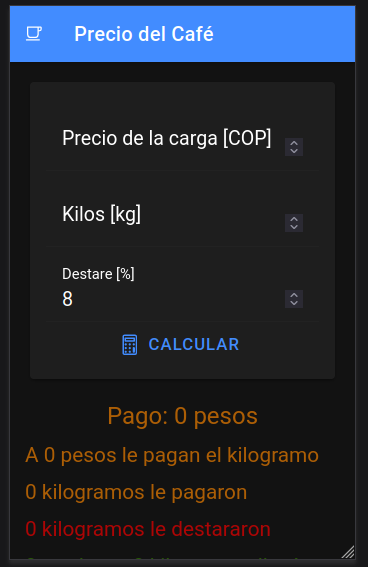
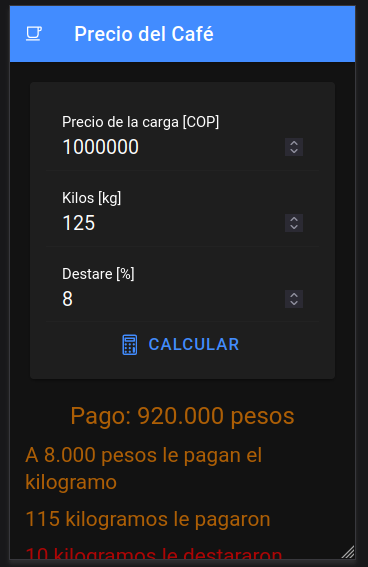
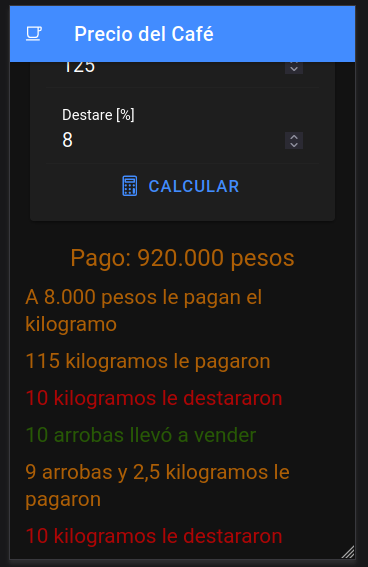

# PrecioCafe

Esta aplicación fue realizada para ayudar a los caficultores a calcular adecuadamente el precio que deben recibir cuando venden sus productos. A continuación, se describen los elementos de la interfaz:

* Precio de la carga [COP]: Se debe colocar el precio de la carga de café que equivale a 10 arrobas o 125 kilogramos.

* Kilos [kg]: El total de kilogramos que se registró en la pesa, báscula o reloj.

* Destare [%]: Es el destare porcentual que le hacen. En muchas ocasiones por venderlo mojado le destaran el 8% del total.

## Ejemplo 

La carga de café mojada está a 1 millón de pesos, llevó a vender 125 kilogramos y le destararon el 8%.

